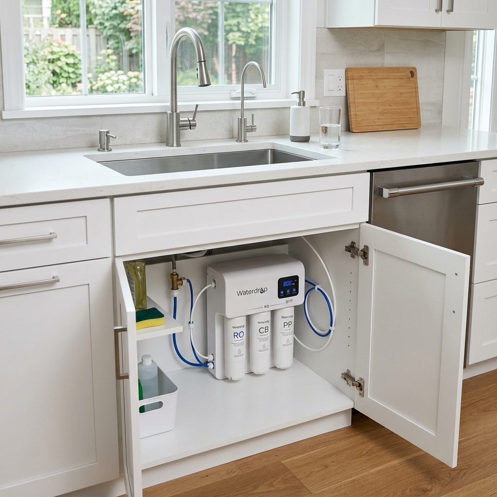
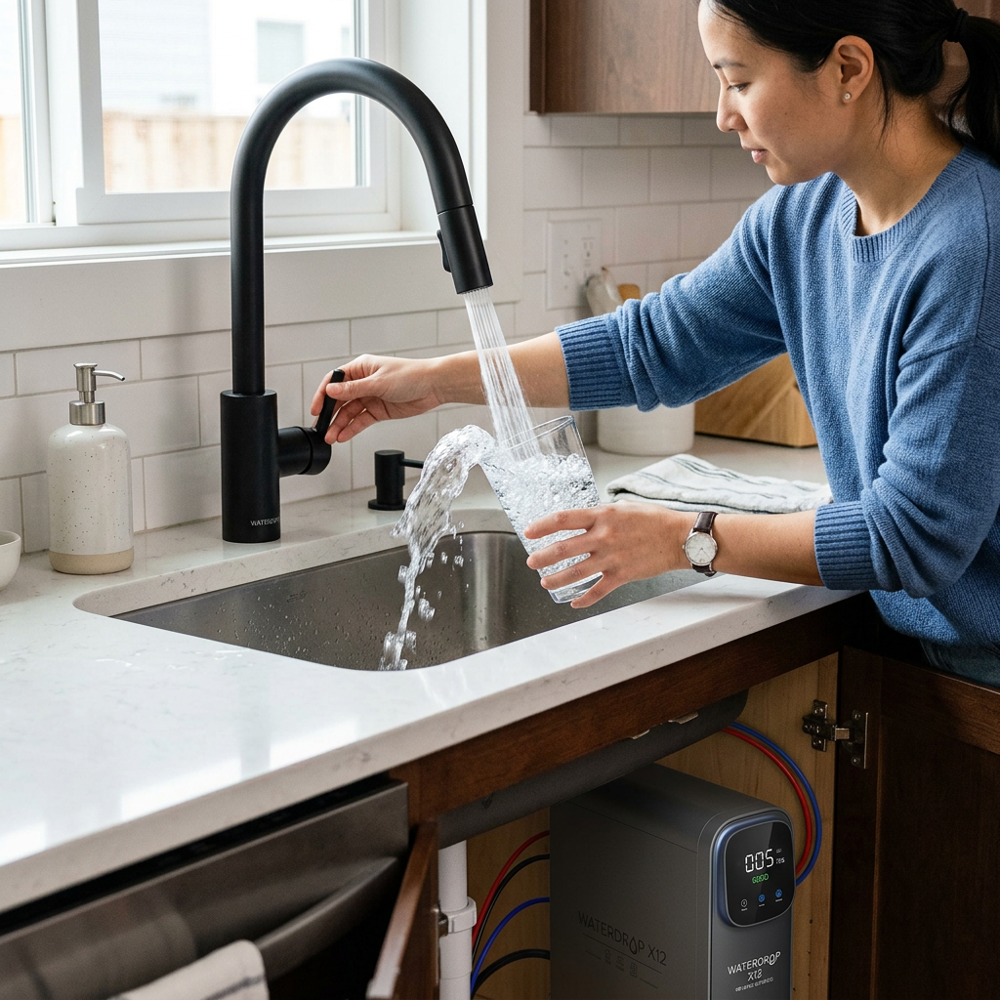
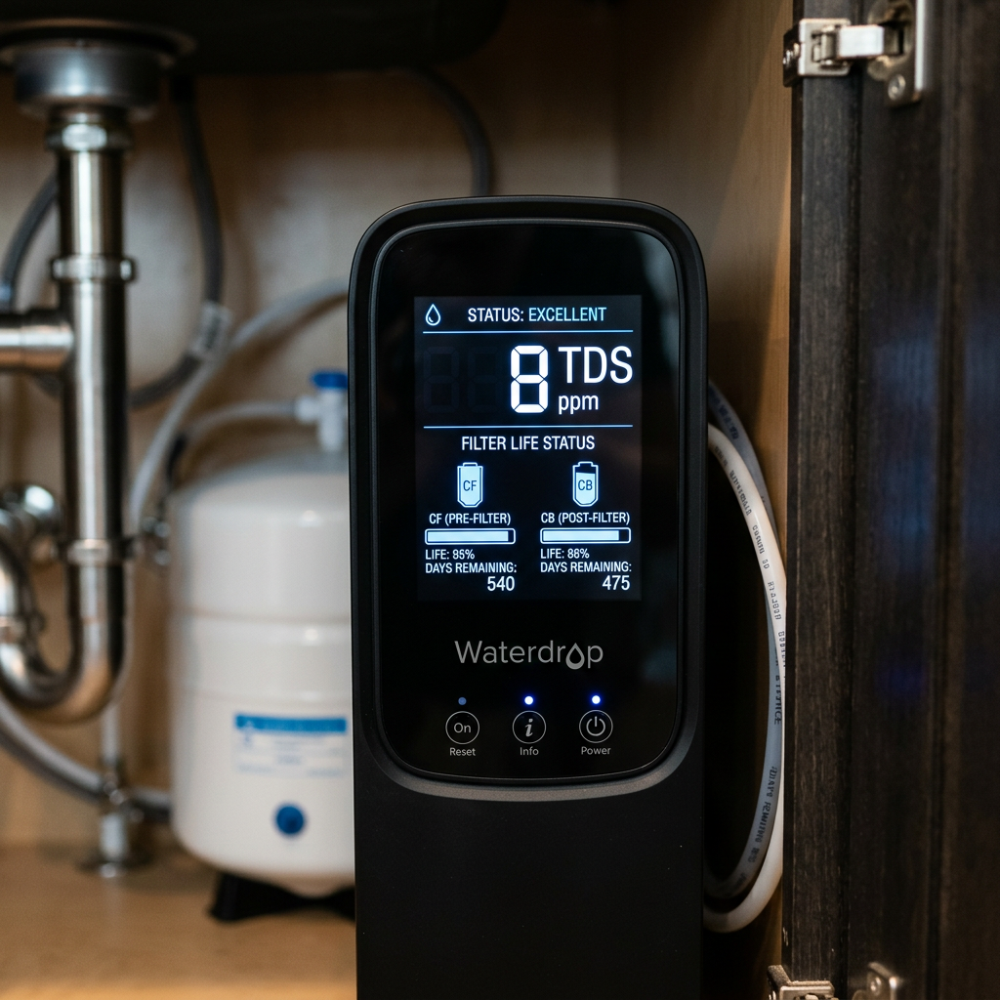
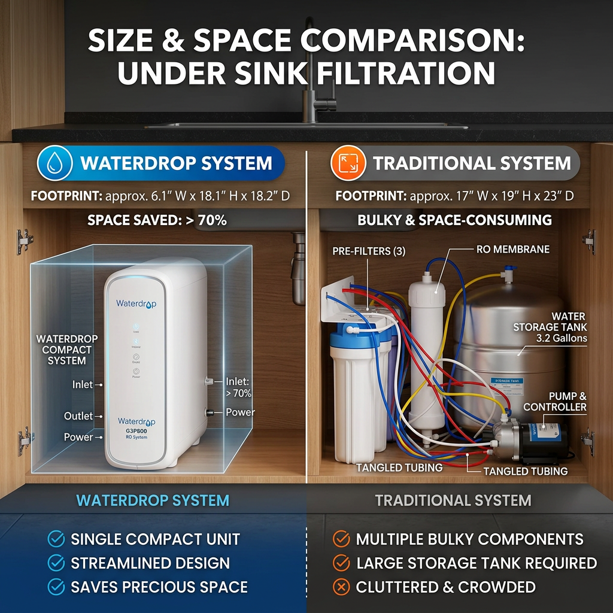

# Ultimate Waterdrop Under Sink Filter Review: Is It the Best Choice for Your Home?

<h2>Why You Need a Waterdrop Under Sink Filter Today</h2>
In an era where water quality is increasingly questionable, finding a reliable solution for your home is paramount. The <strong>waterdrop under sink filter</strong> has emerged as a frontrunner in the water purification market, offering a blend of sophisticated technology and user-friendly design. If you are looking to eliminate contaminants like lead, chlorine, and fluoride while maintaining a sleek kitchen aesthetic, the waterdrop under sink filter is your ultimate answer.
<figure class="wp-block-image size-large"></figure>
High-intent buyers know that not all filtration systems are created equal. The waterdrop under sink filter distinguishes itself through its multi-stage filtration process. Unlike traditional bulky systems, this waterdrop under sink filter fits perfectly in tight spaces, ensuring you don't have to sacrifice storage for safety. When you install a waterdrop under sink filter, you are investing in the long-term health of your family.
<h3>The Superior Technology of the Waterdrop Under Sink Filter</h3>
What makes the waterdrop under sink filter so effective? It utilizes advanced composite filter membranes that capture even the smallest particles. The waterdrop under sink filter is designed to provide a fast flow rate, meaning you won't be waiting minutes just to fill a glass. Furthermore, the waterdrop under sink filter features a smart design that alerts you when it is time for a replacement, taking the guesswork out of maintenance.
<a href="https://pboost.me/M121azM2?uid=seo" class="btn checkout-btn" target="_blank" rel="sponsored">Click here to check price</a><h3>Comparing the Waterdrop Under Sink Filter to Competitors</h3>
When shopping for a waterdrop under sink filter, it is helpful to see how it stacks up against standard alternatives. The following table highlights why the waterdrop under sink filter remains the preferred choice for savvy homeowners.
<table><thead><tr><th>Feature</th><th>Waterdrop Under Sink Filter</th><th>Standard Carbon Filter</th></tr></thead><tbody><tr><td>Filtration Accuracy</td><td>0.0001 micron (RO models)</td><td>5.0 micron</td></tr><tr><td>Installation Time</td><td>Less than 30 mins</td><td>2+ Hours</td></tr><tr><td>Space Saving</td><td>Tankless Design</td><td>Bulky Tank Required</td></tr><tr><td>Filter Life</td><td>12-24 Months</td><td>3-6 Months</td></tr><tr><td>Flow Rate</td><td>High (Fast Fill)</td><td>Low/Restricted</td></tr></tbody></table>
As you can see, the waterdrop under sink filter outperforms traditional models in every critical category. The waterdrop under sink filter provides a higher level of purity without the hassle of a complex setup. For those who value efficiency, the waterdrop under sink filter is the clear winner.
<figure class="wp-block-image size-large"></figure><h2>Key Benefits of Installing a Waterdrop Under Sink Filter</h2>
The primary reason most people search for a waterdrop under sink filter is the immediate improvement in taste and odor. Tap water often carries a heavy chemical scent, but the waterdrop under sink filter removes these impurities instantly. Beyond taste, the waterdrop under sink filter provides peace of mind by removing heavy metals that can be harmful over time.

Another significant advantage of the waterdrop under sink filter is the cost savings. By using a waterdrop under sink filter, you can stop purchasing expensive bottled water, which is both a financial drain and an environmental hazard. The waterdrop under sink filter pays for itself within the first few months of use. Additionally, the waterdrop under sink filter is incredibly easy to maintain. Most waterdrop under sink filter models feature a twist-and-pull design that allows you to change filters in seconds.
<h3>How the Waterdrop Under Sink Filter Enhances Your Lifestyle</h3>
Imagine waking up and having access to crisp, glacier-fresh water right from your tap. That is the reality with a waterdrop under sink filter. Whether you are brewing coffee, cooking pasta, or simply hydrating after a workout, the waterdrop under sink filter ensures that every drop is of the highest quality. The waterdrop under sink filter is also a favorite among pet owners who want to ensure their furry friends are drinking clean water.
<figure class="wp-block-image size-large"></figure>
Furthermore, the waterdrop under sink filter is designed with sustainability in mind. By choosing a waterdrop under sink filter, you are reducing your carbon footprint significantly. The long-lasting cartridges of the waterdrop under sink filter mean less waste in landfills compared to smaller, less efficient filters. Every waterdrop under sink filter is a step toward a greener planet.
<a href="https://pboost.me/M121azM2?uid=seo" class="btn checkout-btn" target="_blank" rel="sponsored">Click here to check price</a><h2>Installation and Maintenance of Your Waterdrop Under Sink Filter</h2>
One of the most frequent questions buyers have is whether the waterdrop under sink filter is difficult to install. Fortunately, the waterdrop under sink filter was engineered for DIY enthusiasts. You don't need a professional plumber to get your waterdrop under sink filter up and running. The package for the waterdrop under sink filter includes everything you need, and the instructions are crystal clear.

Maintenance for the waterdrop under sink filter is equally simple. Because the waterdrop under sink filter uses high-capacity cartridges, you only need to think about it once or twice a year. The waterdrop under sink filter system will even beep or change light colors to remind you when a filter change is due. This smart technology ensures your waterdrop under sink filter is always performing at its peak.
<h3>Final Verdict: Is the Waterdrop Under Sink Filter Worth It?</h3>
If you are serious about water purity, the waterdrop under sink filter is an unbeatable investment. The combination of space-saving design, elite filtration, and ease of use makes the waterdrop under sink filter the gold standard in the industry. Don't settle for subpar water when the waterdrop under sink filter is readily available to transform your home's tap water.
<figure class="wp-block-image size-large"></figure>
In conclusion, the waterdrop under sink filter offers a comprehensive solution for any household. From its sleek look to its powerful performance, the waterdrop under sink filter meets the needs of even the most discerning buyers. Upgrade your kitchen today with a waterdrop under sink filter and experience the difference that truly clean water makes.
<a href="https://pboost.me/M121azM2?uid=seo" class="btn checkout-btn" target="_blank" rel="sponsored">Click here to check price</a>